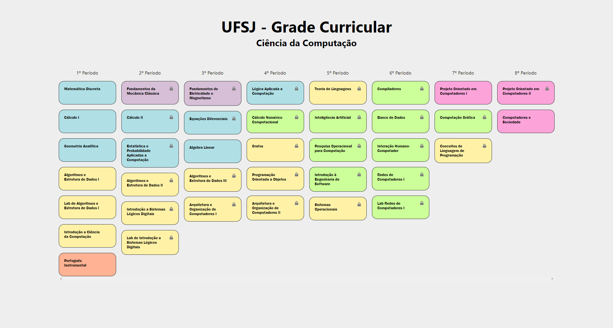

# UFSJ - Grade Curricular - Ciência da Computação

<br>

This is a React project to view the curriculum from Computer Science in UFSJ. 

The user can click on each subject to complete it, but only if it has no active dependencies.

<br>

## Screenshot



<br>

## 🖥 Running locally

```bash
# Clone
git clone https://github.com/gabriel-dp/UFSJ_Curriculum_CS.git

# Node modules
npm install

# Open project on localhost
npm start
```